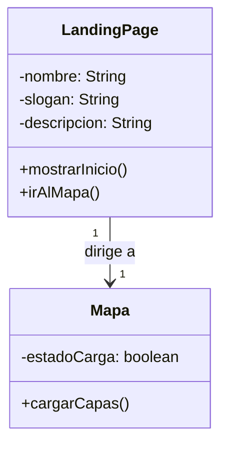
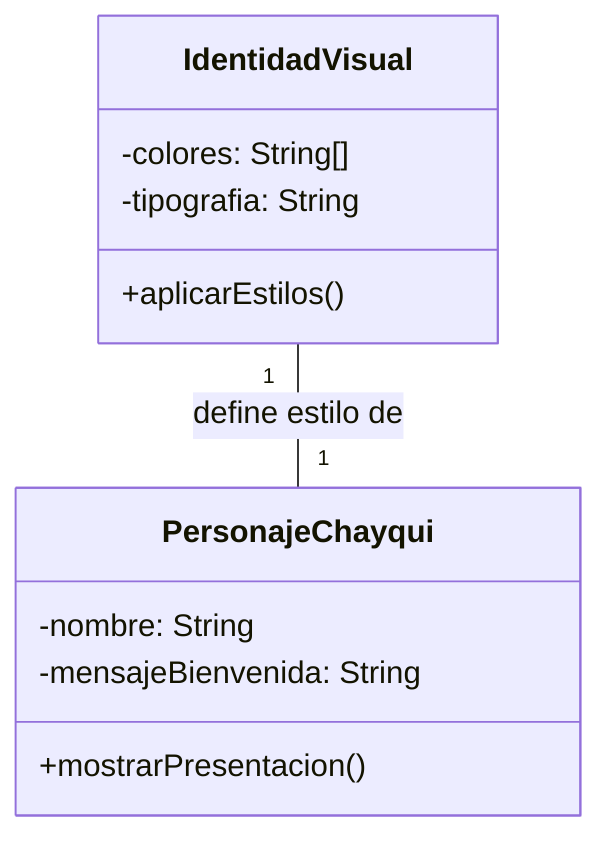
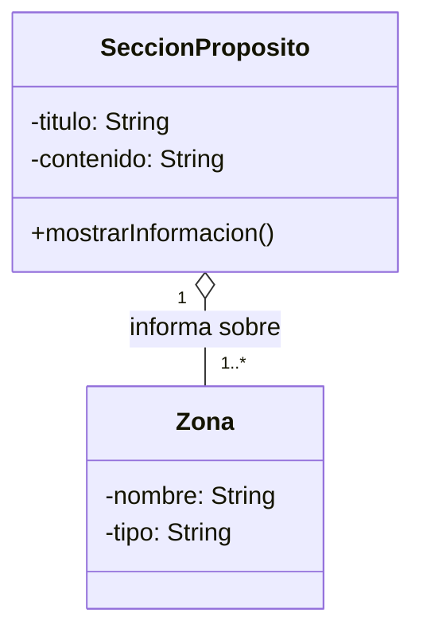

## HU-001: Página de inicio atractiva de CaliLand

```mermaid
classDiagram
    class LandingPage {
        -nombre: String
        -slogan: String
        -descripcion: String
        +mostrarInicio()
        +irAlMapa()
    }
    class Mapa {
        -estadoCarga: boolean
        +cargarCapas()
    }

    LandingPage "1" --> "1" Mapa : dirige a
```
---

## HU-002: Identidad visual propia de Huánuco

```mermaid
classDiagram
    class IdentidadVisual {
        -colores: String[]
        -tipografia: String
        +aplicarEstilos()
    }
    class PersonajeChayqui {
        -nombre: String
        -mensajeBienvenida: String
        +mostrarPresentacion()
    }

    IdentidadVisual "1" -- "1" PersonajeChayqui : define estilo de
```
---
## HU-003: Conocer el propósito de CaliLand

```mermaid
classDiagram
    class SeccionProposito {
        -titulo: String
        -contenido: String
        +mostrarInformacion()
    }
    class Zona {
        -nombre: String
        -tipo: String
    }

    SeccionProposito "1" o-- "1..*" Zona : informa sobre
```
---
