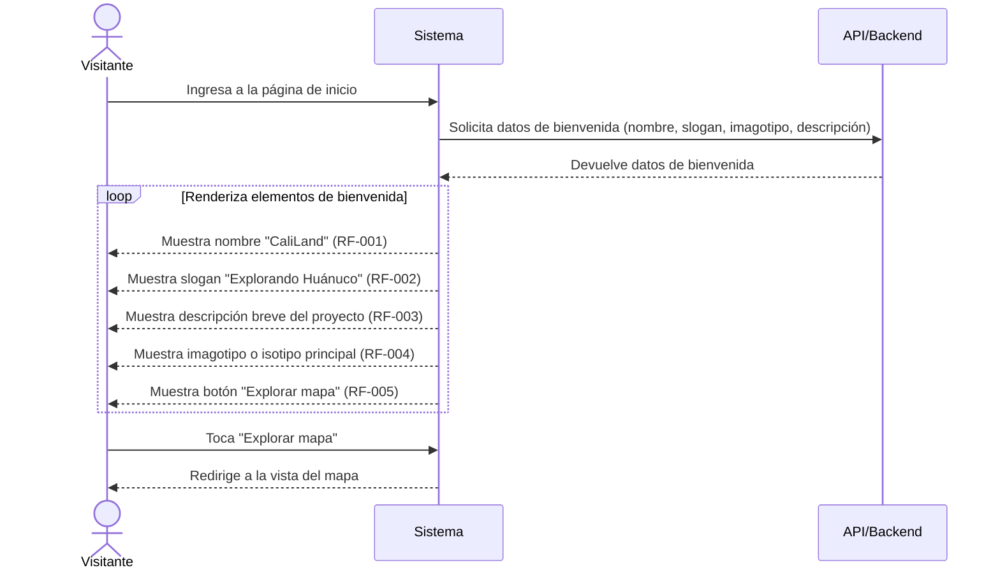

# HU-001: Página de inicio atractiva de CaliLand

**Como** visitante, **quiero** ver una página de inicio atractiva **para** entender rápidamente qué es CaliLand y poder explorar el mapa.

## Requerimientos cubiertos

| RF | Descripción |
| :--- | :--- |
| RF-001 | Mostrar el nombre CaliLand. |
| RF-002 | Mostrar el slogan "Explorando Huánuco". |
| RF-003 | Mostrar una descripción breve del proyecto. |
| RF-004 | Mostrar el imagotipo o isotipo principal. |
| RF-005 | Mostrar un botón principal "Explorar mapa". |

## Diagrama de secuencia

